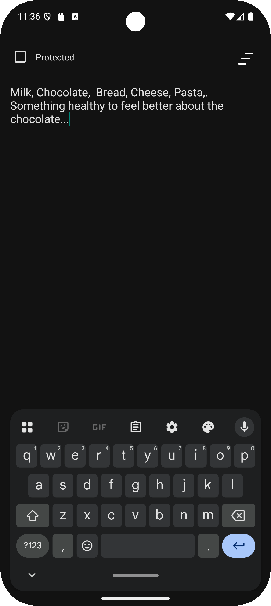

# 🔐 BullNote - Secure Note-Taking App

## 📜 Overview
**BullNote** is a modern, secure, and user-friendly Android application designed for taking and managing notes with a strong emphasis on privacy and performance.  
Built with cutting-edge Android technologies, this project showcases my skills in mobile development, database management, and security implementation.  
Whether you're jotting down quick thoughts or storing sensitive information, **BullNote** ensures your data stays safe and accessible only to you.

---

## ⚡ Key Features
- 🔒 **Encrypted Storage**: Utilizes **SQLCipher** to encrypt notes in a **Room** database, ensuring top-tier security for sensitive data.
- 👤 **Biometric Authentication**: Seamlessly integrates Android's **Biometric API** for secure and convenient access.
- 🎨 **Intuitive UI**: Built with **Material Design** and **RecyclerView** for a smooth, responsive user experience.
- 📱 **Cross-Version Compatibility**: Supports Android 7.0 (API 24) and above, optimized up to Android 15 (API 35).
- ⚙️ **Efficient Data Management**: Leverages **LiveData** and **ViewModel** from Android Jetpack for real-time updates and robust state management.

---

## 🛠️ Tech Stack
- **Language**: Java 11  
- **Android SDK**: Target SDK 35, Minimum SDK 24  
- **Libraries**:  
  - **AndroidX** (AppCompat, RecyclerView, Room, Biometric, Lifecycle)  
  - **SQLCipher** for database encryption  
  - **Material Components** for UI  
  - **JUnit** and **Espresso** for testing  
- **Build Tools**: **Gradle** with **R8** for code minification and optimization  
- **Architecture**: **MVVM** (Model-View-ViewModel) for clean and maintainable code  

---

## 💡 Why This Project?
**BullNote** is more than just a note-taking app — it’s a demonstration of my ability to:  
- 🛡️ Design and implement **secure mobile applications** with a focus on **user privacy**.  
- 🛠️ Work with **modern Android development tools** and **best practices**.  
- 🔑 Handle complex features like **database encryption** and **biometric authentication**.  
- ⚡ Optimize apps for **performance** and **compatibility** across a wide range of devices.  

This project reflects my passion for solving real-world problems through code and my commitment to delivering high-quality software.

---

## 🚀 Getting Started

### 📋 Prerequisites
- **Android Studio** (latest stable version)  
- **JDK 11**  
- **Android device or emulator** (API 24+)

### 📥 Installation
1. Clone the repository:  
   ```bash
   git clone https://github.com//AntonMuzhytskyi/BullNote.git
   
2. Open the project in Android Studio.  
3. Sync the project with Gradle files. 
5. Build and run the app on an emulator or physical device.  

### Building a Release APK
- Configure the signing settings in `app/build.gradle` (see `signingConfigs`).  
- Run `./gradlew assembleRelease` to generate a signed APK.


## 📦 Download APK

Want to try the app without building it yourself?

👉 [**Download BullNote v1.0 (APK)**](https://github.com/AntonMuzhytskyi/BullNote/releases/download/v1.0/BullNote.apk)

> Compatible with Android 7.0 (API 24) and up.

 ## 🖼️ Screenshots

 
  
 


## About Me
I’m a dedicated Android developer with a strong foundation in Java, Android SDK, and modern app architecture. 
Through BullNote, I’ve honed my skills in security, UI/UX design, and performance optimization. 
I’m eager to bring my expertise to innovative projects and collaborate with teams that value clean code and user-focused solutions.  

Feel free to contact me to discuss potential opportunities or explore the code!
